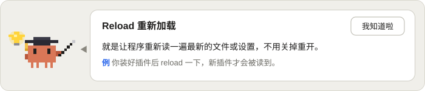

# knowledge-card

AI 干活的时候，你在输入框上方看到一张**知识卡片**：一个当前任务里用到的概念，一句大白话，一个贴近任务的小例子。等待的时间，顺手学一点马上能懂的东西。

A [Claude Code mod](https://claude.dev/blog/getting-started-with-claude-code-mods/) that shows one plain-language knowledge card above the prompt while the AI works, so waiting time becomes learning time.

<p align="center"></p>

> mod 是运行在你 Claude Code 会话里的代码，权限和 Claude Code 一样大。安装前请先读源码，这个插件只有一个文件：`plugins/knowledge-card/hooks/register.tsx`。
> A mod runs inside your session with the same access as Claude Code. Read the source first; this one is a single file.

## 安装 / Install

```
/plugin marketplace add YanZiBin/knowledge-card
/plugin install knowledge-card@knowledge-card
/reload-plugins
```

这个插件没有上架 Claude 官方目录，仓库本身就是一个插件市场，所以上面三行直接从 GitHub 安装。网络访问 GitHub 不方便的话，可以先把仓库克隆到本地，再从本地文件夹安装：

```
git clone https://github.com/YanZiBin/knowledge-card
```
```
/plugin marketplace add ./knowledge-card
/plugin install knowledge-card@knowledge-card
/reload-plugins
```

需要支持 mod 的 Claude Code（2.1.287 或更新）。mod 的接口可能随版本变化。吉祥物用 `Svg` 元素画，目前只在**桌面版**里测过；终端里没有这个元素，会去掉吉祥物，只留卡片文字（未测试）。
It is not listed in Claude's official directory; the repo itself is the marketplace, so the commands above install straight from GitHub. You can also `git clone` it and run `/plugin marketplace add ./knowledge-card` instead.

Needs a Claude Code build that supports mods (2.1.287 or later). The mascot is drawn with the `Svg` element and has only been tried in the desktop app; elsewhere it is left out (untested).

## 它怎么工作 / How it works

1. 你发消息，插件记下这个任务。
2. 主对话这一轮跑满约 10 秒后，插件调用一次小模型，生成一张卡片：标题、一句大白话、一个例子。内容以 AI **眼前这一步**用到的概念为主，没有合适的就讲任务所在领域的通用知识。
3. 卡片**一直留着**，AI 干完活也不会自己消失，直到你点**我知道啦**。
4. 点了以后，如果 AI 还在干活，马上生成下一张；如果 AI 停着，就等你下次发消息、AI 干满 10 秒再生成。你不点，就不会再调用小模型。
5. 点过的标题会被记住（跨会话，最多 500 个，超出时挤掉最旧的），之后不会再出。

- 一轮不到 10 秒就结束，不出卡片。
- 一次没生成出卡片（比如连续两次都撞上学过的标题，或小模型没回复），这个任务里就不再重试，等你发下一个任务或点按钮再说。
- 卡片会放在其他同样用这个位置的插件**上面**，不会把它们顶掉。
- 子 Agent 的事件不算，后台任务的通知不会清掉卡片或重置任务。

1. You send a prompt; the plugin notes the task.
2. Once the main turn has run for about 10 s, a small model writes one card: a title, a plain sentence and an example. It prefers the concept in the step the AI is on right now, and falls back to general knowledge of the task's field.
3. The card **stays** until you press the button, even after the turn ends.
4. After you press it, the next card is made at once if the AI is still working; otherwise it waits for your next prompt and 10 s of work. If you never press, no more model calls are made.
5. Titles you have dismissed are remembered across sessions (up to 500, the oldest drop out) and are not shown again.

## 费用与隐私 / Cost and privacy

- 每张卡片是一次独立的小模型请求（输入约一两千 token），两次请求之间至少隔 20 秒；卡片还在屏幕上时一次都不调。这些调用计入你自己的账号额度。
- 发给小模型的内容有：你的任务原话、主对话最近说的 3 段话（每段最多 400 字）、最近 14 次操作（命令只取前 120 个字）、最近 80 个学过的标题。看起来像密钥的内容（`Bearer …`、`sk-…`、`token=…`、`--password …`）会先替换成 `***`，但这只按常见写法识别，**不保证**所有密钥都认得出来。
- 学过的标题存在 Claude Code 给这个插件的本地存储里（`$.store`），不写你的项目目录，也不上传到别处。
- 请求发给你自己的 Claude Code 账号所连接的服务，没有第三方。

Each card is one separate small-model request, at least 20 s apart, none while a card is on screen; it counts against your own account. What is sent: your prompt, the last 3 things the assistant said, the last 14 actions (commands cut to 120 characters) and the last 80 dismissed titles; credential-looking strings are masked first, but only for common shapes. Dismissed titles live in the plugin's local store.

## 改成你想要的样子 / Make it yours

都在 `plugins/knowledge-card/hooks/register.tsx` 开头：

- `MODEL` / `EFFORT`：用哪个模型和思考强度（默认 `claude-sonnet-5-5`、`low`，你的账号需要能用它）。
- `FIRST_AFTER_MS` / `MIN_GAP_MS`：多久出第一张、两次调用的最短间隔。
- `LEARNED_MAX` / `LEARNED_SENT`：记住多少个标题、发给小模型多少个。
- `SYSTEM`：给小模型的说明。**默认让它写简体中文、按零基础来讲**，想要别的语言或难度，改这里。
- `PIXELS`：吉祥物的像素表，一行一个色块 `[x, y, 宽, 高, 颜色]`，想换帽子、教鞭或灯泡就改它。

Constants at the top of `register.tsx`. The `SYSTEM` prompt asks for Simplified Chinese and a zero-background explanation; edit it for another language or level. `PIXELS` is the mascot, one block per row.

## 已知局限 / Known limits

- 卡片的内容由小模型生成，可能讲错。当成"帮你入门的一句话"，别当权威答案。
- 吉祥物的颜色是固定的，不随浅色/深色主题变化；深色主题下黑色教鞭会不太显眼。
- 小模型调用失败（比如模型不可用）时，每个任务弹一次提示，然后保持安静。
- 吉祥物是依照 Claude Code 里橙色像素小怪物 Clawd 的样子画的**非官方同人作品**，与 Anthropic 无关。
- 这是一个小工具，不保证稳定。

Card text is model-written and can be wrong. The mascot is an unofficial fan drawing inspired by Claude Code's Clawd, not affiliated with Anthropic.

## License

MIT
